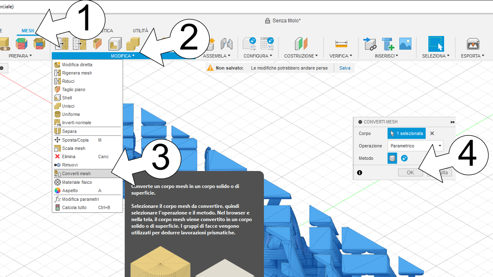
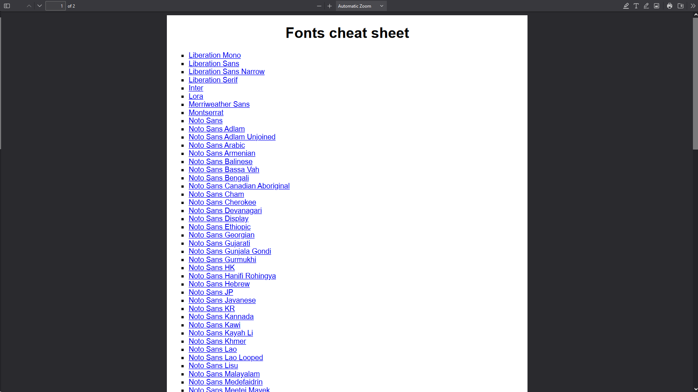

# Generatore di ambigrammi  (completamente personalizzabile)

Questo è uno script [OpenSCAD](https://openscad.org/) per generare due testi in 3D che si fondono, ed ogni testo è visibile da un punto di vista diverso.

Questa è la versione PDF del file README_it.md che potete trovare [nel repository GitHub](https://github.com/zizzo81/ambigram).

Questo script è stato pubblicato e può essere trovato e usato direttamente su [MakerWorld](https://makerworld.com/en) a questa [pagina](https://makerworld.com/en/models/489660).

This page is available in English. Questa guida è disponibile in inglese.

### Sommario

- [Guida di tutti i parametri nelle schede](#guida-di-tutti-i-parametri-nelle-schede)
  - [Texts](#texts)
  - [Font](#font)
  - [Base](#base)
  - [Top](#top)
  - [Tweaks (fix thing up)](#tweaks-fix-things-up)

- [Come rimuovere oggetti indesiderati](#come-rimuovere-oggetti-indesiderati)
- [Come usare i simboli nei testi](#come-usare-i-simboli-nei-testi)
  - [Come inserire un cuore](#come-inserire-un-cuore)
  - [Su Windows](#su-windows)
  - [Su macOS](#su-macos)
  - [Usando i cheat sheet disponibili](#usando-i-cheat-sheet-disponibili)
  
- [Lista delle versioni](#lista-delle-versioni)
- [Ringraziamenti](#ringraziamenti)

## Guida di tutti i parametri nelle schede

Segue una dettagliata guida che spiega ogni possibile impostazione. Sentitevi liberi di esplorare le infinite possibilità che combinare questi valori consentono.

### Texts

In questa scheda vanno impostate i parametri base sui testi da mostrare.

| Parametro            | Descrizione                                                  | u.m.  | min  | max  | predefinito       |
| -------------------- | ------------------------------------------------------------ | ----- | ---- | ---- | ----------------- |
| text_1               | Inserire qui il testo che sarà visibile: - da sinistra se *text_mode* è *Left-Right*; - da sopra nelle altre modalità. | testo |      |      | "SUSANNA"         |
| text_2               | Inserire qui il testo che sarà visibile: - da destra se *text_mode* è *Left-Right*; - da davanti nelle altre modalità. | testo |      |      | "CHRISTIAN"       |
| text_mode            | Questo parametro definisce la modalità di creazione dei testi e può essere: - **Left-Right** - un testo è visibile da un punto di vista di una posizione angolata a sinistra, mentre l'altro è visible da un'altra posizione angolata da destra; - **Front-Top** - un testo è visible guardando l'oggetto da sopra, mentre l'altra guardando il testo da davanti; - **45° front-Top** - un testo è visible guardando l'oggetto da sopra, mentre l'altra guardando il testo da un'angolazione di 45° tra davanti e sopra. |       |      |      | Left-Right        |
| render_engine        | Questo parametro permette all'utente di scegliere quale motore di creazione dell'oggetto utilizzare durante l'esecuzione di questo script, dando una sorta di retrocompatibilità. Questo valore può essere: - **v1.0 - legacy** - verrà utilizzata la vecchia versione 1.0 del motore di creazione, la quale ha notoriamente alcune limitazioni; - **v2.0 - NEW! produces a cleaner object** - questo valore abilita l'utilizzo della nuova versione 2.0 del motore di creazione oggetti la quale lavora meglio, crea oggetti più puliti e precisi, risolve un sacco di problemi ed è più veloce e precisa nei calcoli, dando nuove possibilità all'utente. |       |      |      | v2.0              |
| text_angle           | Questo parametro è utilizzato solamente nella modalità *Left-Right* e consente di impostare l'angolo, rispetto al centro dal quale i due testi saranno visibili. | gradi | 0    | 180  | 45                |
| text_shape           | Questo valore consente di modificare la sagoma dell'oggetto che può essere vista da sopra ed i valori possono essere: - **Rectangle** - il modello iniziale, visto da sopra l'oggetto sarà un rettangolo con due punte ai lati; - **Circle** - visto da sopra l'oggetto sarà un d; - **Heart** - visto da sopra l'oggetto avrà la forma di un cuore; - **Rounded rectangle** - crea un rettangolo con gli angoli arrotondati (disponibile solamente quando si utilizza il nuovo motore di generazione). |       |      |      | Rounded rectangle |
| text_roundness       | Se *text_shape* è impostato a *Rounded rectangle*, questa è la percentuale di rotondità da dare agli spigoli. Un valore di zero genererà un rettangolo perfetto, un valore di cento creerà un rettangolo terminante sui due lati con un semi-cerchio perfetto. | %     | 0    | 100  | 50                |
| text_heart_direction | Se *text_shape* è impostato a *Heart*, questo parametro indica la direzione in cui punta la parte acuminata del cuore e può essere: - **Left** - il cuore punta nella stessa direzione da cui è visibile la scritta a sinistra; - **Right** - il cuore punta nella stessa direzione da cui è visibile la scritta a destra; - **Middle** - il cuore punta al centro tra i due testi. |       |      |      | Left              |
| text_padding         | Indica che carattere utilizzare per allungare le parole e raggiungere una lunghezza uguale, può valere: - **Space** - uno spazio, il che significa avere un piccolo oggetto in questa posizione; - **Heart** - verrà inserito un carattere a forma di cuore; |       |      |      | Space             |

### Font

In questa scheda si possono impostare tutti i parametri riguardo al font che deve essere utilizzato per i testi.

| Parametro    | Descrizione                                                  | u.m. | min  | max  | predefinito       |
| ------------ | ------------------------------------------------------------ | ---- | ---- | ---- | ----------------- |
| font_name    | Selezionare uno dei font disponibili dalla lista per applicarlo sui testi.  **Prestare attenzione!** I font complessi e generalmente i font con le grazie tendono a generare oggetti volanti indesiderati i quali saranno uno spreco di materiale e tempo durante la stampa. Si consideri di utilizzare font senza grazie e/o leggere la mia guida su come rimuovere tali oggetti usando Fusion 360 che potete trovare qui sotto. |      |      |      | Merriweather Sans |
| font_custom  | Qui è possibile sovrascrivere il valore del parametro precedente inserendo il nome di un font installato sul sistema dove lo script è eseguito.  **Prestare attenzione!** Si prega di notare che quando si utilizza questo script all'interno del Parametric Model Maker, il sistema su cui lo script è in esecuzione è il server di MakerWorld, non il vostro computer. |      |      |      | *vuoto*           |
| font_style   | Selezionare lo stile da applicare al font. Questo valore può anche essere impostato a *None*, il quale utilizzerà lo stile predefinito del font. **Nota:** non tutti i font supportano tutti gli stili disponibili. |      |      |      | Bold              |
| font_size    | La dimensione del testo, risulterà l'altezza dell'oggetto al netto di base e piano superiore e la profondità dell'oggetto. | mm   | 1    | 72   | 20                |
| font_spacing | La spaziatura tra le lettere, più grande è il numero, più distante sono le lettere. I risultati migliori si ottengono quando le lettere si toccano tra di loro, se non lo fanno, sarà necessaria una base solida per mantenerle assieme. |      | 0.1  | 5    | 0.75              |

### Base

Per mantenere le lettere unite è necessario creare un piatto di base, questi parametri permettono di personalizzarne la creazione.

| Parametro            | Descrizione                                                  | u.m. | min  | max  | predefinito |
| -------------------- | ------------------------------------------------------------ | ---- | ---- | ---- | ----------- |
| base_type            | Specifica il tipo di base e può essere: - **None** - non verrà creata nessuna base; - **Solid** - verrà creata una base solida appena sotto le lettere; - **Text** - verrà realizzata una base con la forma del testo visibile dall'alto e posizionata alla base delle lettere, si prega di notare che questo valore non è supportato in modalità *Left-Right* e che in tale modalità verrà considerato *Solid*. |      |      |      | Text        |
| base_height          | L'altezza della base.                                        | mm   | 0.2  | 25   | 3           |
| base_x_correction    | OpenSCAD non rende disponibili funzionalità per ottenere l'altezza e la larghezza dei testi creati, pertanto i calcoli devono essere approssimati, ciò può produrre delle discrepanze. Questo parametro permette di modificare la posizione della base sull'asse X  e verrà applicata dopo il calcolo automatico della posizione. | mm   | -100 | 100  | 0           |
| base_y_correction    | Stesso parametro di *base_x_correction*, ma applicato all'asse Y. | mm   | -100 | 100  | 0           |
| base_z_correction    | Stesso parametro di *base_x_correction*, ma applicato sull'asse Z. | mm   | -100 | 100  | 0.4         |
| base_size_correction | Per le stesse ragioni di cui al parametro *base_x_correction*, questo parametro consente di allargare o restringere la base. | mm   | -100 | 100  | 0           |
| base_heart_size      | La correzione da applicare alla forma del cuore usata per la base. | mm   | -100 | 100  | 0           |
| base_heart_x         | Correzione sull'asse X della posizione del cuore.            | mm   | -100 | 100  | 0           |
| base_heart_y         | Correzione sull'asse Y della posizione del cuore.            | mm   | -100 | 100  | 0           |

### Top

Parametri che permettono di creare e scegliere un piano da aggiungere sopra i testi.

| Parametro           | Descrizione                                                  | u.m. | min  | max  | predefinito |
| ------------------- | ------------------------------------------------------------ | ---- | ---- | ---- | ----------- |
| top_type            | Specifica il tipo di piano da creare e può essere: - **None** - non verrà creata nessun piano superiore; - **Solid** - verrà creato un piano superiore solido apposto appena sopra le lettere; - **Text** - verrà creato un piano superiore con la forma del testo visibile dall'alto e posizionato appena sopra le lettere, si prega di notare che questo valore non è supportato in modalità *Left-Right* e che in tale modalità verrà considerato *Solid*. |      |      |      | None        |
| top_height          | L'altezza del piano superiore.                               | mm   | 0.2  | 25   | 3           |
| top_x_correction    | OpenSCAD non rende disponibili funzionalità per ottenere l'altezza e la larghezza dei testi creati, pertanto i calcoli devono essere approssimati, ciò può produrre delle discrepanze. Questo parametro permette di modificare la posizione del piano superiore sull'asse X  e verrà applicata dopo il calcolo automatico della posizione. | mm   | -100 | 100  | 0           |
| top_y_correction    | Stesso parametro di *top_x_correction*, ma applicato all'asse Y. | mm   | -100 | 100  | 0           |
| top_z_correction    | Stesso parametro di *top_x_correction*, ma applicato sull'asse Z. | mm   | -100 | 100  | 0.4         |
| top_size_correction | Per le stesse ragioni di cui al parametro *top_x_correction*, questo parametro consente di allargare o restringere il piano superiore. | mm   | -100 | 100  | 0           |
| top_heart_size      | La correzione da applicare alla forma del cuore usata come piano superiore. | mm   | -100 | 100  | 0           |
| top_heart_x         | Correzione sull'asse X della posizione del cuore.            | mm   | -100 | 100  | 0           |
| top_heart_y         | Correzione sull'asse Y della posizione del cuore.            | mm   | -100 | 100  | 0           |

### Tweaks (fix things up)

Alcuni parametri che possono aiutare a sistemare le cose.

| Parametro              | Descrizione                                                  | u.m. | min  | max             |
| ---------------------- | ------------------------------------------------------------ | ---- | ---- | --------------- |
| curves_quality         | Imposta la qualità delle curve da essere utilizzata quando viene generato il modello, più bassa sarà la qualità, più veloce sarà la generazione del modello. E' così lavorare velocemente in modalità bozza (Draft), ma è necessario di ricordarsi di passare alla qualità normale (Normal) o più elevata prima di esportare il modello per la stampa.  I valori possibili sono: - **Draft** - bassa qualità, non opportuno per la stampa; - **Printable draft** - non per una produzione, ma stampabile come prova; - **Normal**: qualità normale, pronta per la stampa; - **Good quality**: buona qualità per la stampa; - **High quality**: qualità veramente buona per la stampa; - **Very high quality**: qualità veramente alta per la stampa ad alta definizione.  **Prestare attenzione!** Parametric Model Maker ha un tempo di timeout dell'esecuzione dello script molto corto per evitare attacchi DDoS, per questo motivo impostare un valore troppo auto potrebbe generare un errore di timeout. |      |      | Normal          |
| font_ratio             | OpenSCAD non rende disponibili funzionalità per ottenere l'altezza e la larghezza dei testi creati, pertanto i calcoli devono essere approssimati, modificando questo parametro, che rappresenta il rapporto tra l'altezza e la larghezza di una singola lettera, è possibile correggere adeguatamente i calcoli. | 0.1  | 3    | 1.33            |
| small_characters       | Questa è una lista di caratteri che saranno considerati "stretti" e che per tale motivo verranno creati meno profondi (si veda *small_characters_ratio*). |      |      | "!()1I[]fijlt{" |
| small_characters_ratio | Questo è il rapporto tra la profondità di un carattere normale e la profondità di un carattere considerato "piccolo". | 0.01 | 3    | 0.3             |
| space_ratio            | Questo è il rapporto tra la profondità di un carattere normale e la profondità di un rettangolo che verrà creato al posto degli spazi per rendere possibile vedere la lettera dall'altro lato. | 0.01 | 3    | 0.1             |
| disable_warnings       | Applicare il segno di spunta a questa opzione se si desidera aggirare i messaggi di avviso mostrati e proseguire con la generazione dell'oggetto nonostante i messaggi di avviso. |      |      | false           |
| running_at             | Questo parametro imposta dove lo script viene eseguito: - **MakerWorld's Parametric Model Maker** - lo script si assicurerà che sia stata selezionata una combinazione di font e stile tra quelli supporta dai server di MakerWorld, in caso contrario verrà visualizzato un messaggio di errore; - **My computer** - i controlli di cui sopra verranno saltati. |      |      | MakerWorld      |

## Come rimuovere oggetti indesiderati

Come specificato in precedenza, i testi complessi e i font con le grazie tendono a generare degli oggetti volanti indesiderati, i quali all'atto della stampa risulteranno in un inutile spreco di materiale e di tempo. Per questo motivo è stata fatta questa guida passo passo che indicherà come procedere in modo semplice anche per un neofica, alla rimozione dei suddetti utilizzando [AutoDesk Fusion 360](https://www.autodesk.it/products/fusion-360).

Prima di tutto è necessario generare il file STL, noterete che vi sono oggetti "volanti", ovvero oggetti che non sono connessi a nessun altro oggetto e che non hanno materiale inferiore a sostenerli.

Si salvi l'oggetto come file STL.

Se si utilizza Parametric Model Maker di MakerWorld, si faccia click sul pulsante  per assicurarsi di applicare le ultime modifiche ai parametri, quindi, una volta caricato l''oggetto a video, fare click sul pulsante  per scaricare il file.

Quando si aprirà questa finestra di dialogo

Fare click sul pulsante  per scaricare la versione STL.

Se il browser chiede dove salvare il file, andare a selezionare la cartella desiderata e digitare il nome da dare al file, e. g. “oggetti_indesiderati”, che creerà il file “oggetti_indesiderati.stl”.

Se il browser è configurato per salvare automaticamente i file, il file scaricato si chiamerà “Ambigram generator.stl” e si troverà nella cartella in cui vengono salvati i file, solitamente chiamata “Download”.

Aprire ora un nuovo progetto in Fusion 360, dalla barra degli strumenti superiore SOLIDO, selezionare INSERISCI e dal menu a tendina che appare selezionare la voce Inserisci mesh.

Non appena si aprirà questa finestra, fare click sul pulsante **Seleziona dal computer…**.

Comparirà una dialog di seleziona file, recarsi nella cartella in cui è stato scaricato il file, selezionarlo e quindi fare click sul pulsante **Apri**.

L'oggetto sarà posizionato al centro della scena, fare semplicemente click sul tasto **OK**.

E' ora necessario convertire questa in un corpo oggetto.

Con l'oggetto selezionato, seguire i seguenti passi:

1. Fare click su **MESH** nella barra degli strumenti superiore;
2. Fare click su **MODIFICA** nella barra degli strumenti MESH;
3. Selezionare la voce **Converti mesh** dal menu a tendina che si sarà aperto;
4. Fare click su **OK** per avviare la conversione.

Dipendentemente dalla complessità dell'oggetto e dalla potenza computazionale del vostro computer, questa operazione potrebbe richiedere un po' di tempo.

Una volta completata, è necessario disabilitare la cronologia progetto per poter lavorare più liberamente.

Espandere la cartella **Corpi** nel browser degli oggetti facendo click sul piccolo triangolino alla sua sinistra.

Nel browser degli oggetti, fare click con il tasto destro del mouse sul nome in cima e. g. *(Non salvato)*, e dal menu a tendina che apparirà selezionare la voce **Non acquisire cronologia progetto**.

Un messaggio di richiesta conferma apparirà, selezionare **Continua** per smettere di acquisire la cronologia del progetto.

Si proceda ora a selezionare uno alla volta i corpi elencati nel ramo Corpi del browser oggetti.

L'oggetto corrispondente verrà evidenziato di blu sullo schermo, se si tratta di un oggetto volante, fare click con il pulsante destro del mouse sul nome nel browser oggetti e quindi selezionare la voce **Elimina** dal menu a tendina che apparirà.

**Importante:** una volta eliminati tutti i corpi indesiderati (dovrebbe essere rimasto un solo corpo), fare click con il tasto sinistro sulla voce **Corpi** nel browser degli oggetti.

Ora che abbiamo ripulito l'oggetto sarà necessario esportarlo nuovamente come file STL.

Seguire i seguenti passaggii:

1. Selezionare **UTILITA'** nella barra degli strumenti superiore;
2. Premere l'icona **CREA**.

Mentre si è in modalità Crea, l'oggetto sarà evidenziato con un colore blu chiaro, si prega di assicurarsi di selezionare il formato **STL** (binario è il predefinito, ma non è obbligatorio), quindi fare click sul pulsante **OK**.

Una finestra apparirà, si prega di assicurarsi di aver apposto il segno di spunta sulla voce **Salva nel computer** e di selezionare una cartella valida, eventualmente utilizzando il tasto "...", inserire un nome e. g. testo_ripulito, in modo che verrà creato il file testo_ripulito.stl, quindi fare click sul tasto **Salva**.

Open [Bambu Studio](https://bambulab.com/en/download/studio) or your preferred slicer, start a new project and drag the file onto it.

In quasi la totalità dei casi sarà necessario abilitare i supporti per riuscire a stampare questo oggetto, si prega di assicurarsi che nella sezione **Globale**, aprire quindi la scheda **Supporto**, aggiungere il segno di spunta su **Abilita supporti** e selezionare *albero(auto)* come **Tipo** - personalmente ho ottenuto i risultato migliori e più efficaci utilizzando questi.

## Come usare i simboli nei testi

Se si desidera utilizzare simboli particolari nei testi, lo si può fare ma con alcune complicazioni.restrictions.

### Come inserire un cuore

Visto che non tutti i font includono il glifo di un cuore e quelli che lo fanno solitamente hanno codici diversi l'uno dall'altro, ho creato una speciale sequenza di caratteri per inserire un cuore. Nella posizione in cui si vuole inserire il glifo di un cuore, basta ora inserire **\h**.

### Su Windows

Dal menu start, open **Mappa caratteri**.

Selezionare dall'elenco a vista il font che si sta utilizzando nel proprio modello, quindi cercare nella lista dei glifi quello desiderato, fare click su di esso e premere quindi il pulsante **Seleziona**, è possibile ripetere l'operazione per aggiungere alla selezione più caratteri, usare quindi il pulsante **Copia** per copiare i caratteri negli appunti, andare su Parametric Model Maker, attivare il campo di testo e incollare dagli appunti.

Alternativamente è possibile copiare il codice del carattere mostrato nell'angolo in basso a sinistra ed inserire il suo valore esadecimale nel campo di testo facendolo precedere dalla sequenza speciale "\u", e. g. : U+2665 diventa \u2665

In alternativa è possibile utilizzare [**Mappa caratteri UWP**](https://apps.microsoft.com/detail/9wzdncrdxf41)

Selezionare il font che si sta utilizzando dalla lista sulla sinistra, scorrere i glifi finche non si trova quello desiderato, fare click su di esso per selezionarlo. Usare il pulsante **Copia** nell'angolo in basso a destra per copiarlo negli appunti.

Alternativamente è possibile copiare il codice del carattere mostrato nell'angolo in basso a destra ed inserire il suo valore esadecimale nel campo di testo facendolo precedere dalla sequenza speciale "\u", e. g. : U+263B diventa \u263B

### Su macOS

Sul sistema operativo Apple esiste uno strumento simile chiamato **Libro Font**, è sufficiente aprirlo dalla cartella Applicazioni.

All'avvio verrà mostrata la lista completa di tutti i font installati sul sistema, cercare il font che si sta utilizzando nello script quindi fare doppio click sulla sua icona per aprire il dettaglio del font.

Scorrere attraverso i glifi alla ricerca di quello che si desidera, quindi farci click sopra per aprirlo, usarer quindi il pulsante **Copia** nell'angolo in basso a destra per copiarlo negli appunti. Incollarlo nel campo di testo dello script.

Alternativamente è possibile copiare il codice del carattere mostrato nell'angolo in basso a sinistra ed inserire il suo valore esadecimale nel campo di testo facendolo precedere dalla sequenza speciale "\u", e. g. : U+263C diventa \u263C

### Usando i cheat sheet disponibili

Ho creato alcuni cheat sheet, a causa delle limitazioni di dimensioni e quantità di upload concessi da MakerWorld ho caricato solamente l'indice dei font qui, potrete trovare tutti i file specifici per font nella [cartella Fonts cheat sheet](https://github.com/zizzo81/ambigram/tree/main/Fonts cheat sheet) su GitHub.

Aprire il file [Fonts cheat sheet.pdf](https://github.com/zizzo81/ambigram/blob/main/Fonts cheat sheet/Fonts cheat sheet.pdf) e quindi fare click sul nome di font che si sta utilizzando, si verrà portato al PDF contenente il cheat sheet per quel font.

Scorrere i glifi e una volta trovato quello che si sta cercando, copiare il codice sotto di esso e incollarlo nei campi di testo dello script.

## Lista delle versioni

| Date       | Description                                                  |
| ---------- | ------------------------------------------------------------ |
| 2024-06-16 | - introdotto un motore di rendering completamente nuovo, questo motore crea oggetti più puliti (con meno oggetti volanti indesiderati), risolve molti problemi, è più preciso con i calcoli e offre nuove opportunità per nuove funzionalità; - correzione: quando *text_left* era più lungo di *text_right*, il testo risultava tagliato a metà verticalmente; - correzione: il piano superiore era posizionata molto al di sopra della fine dell'oggetto; - altre correzioni minori che impedivano l'esecuzione dello script in modo corretto; - nuova caratteristica: il nuovo motore di rendering consente di creare una base rettangolare e una piastra superiore arrotondate; - nuova caratteristica: grazie a delle sequenze speciali è possibile specificare caratteri ASCII e UNICODE; - miglioramento: la forma del cuore non è più considerata sperimentale, poiché con il nuovo motore di rendering è quasi perfetto; - miglioramento: *font_style* ha un nuovo valore possibile di "*None*"; - il nuovo motore di rendering è stato impostato come predefinito, ma è possibile utilizzare quello precedente impostando il parametro *render_engine*; - miglioramento: poiché il nuovo motore di rendering è predefinito e più preciso nei calcoli, sono stati azzerati gli offset di correzione ed i parametri, rimangono ancora disponibili perché è ancora possibile passare al motore precedente; - miglioramento: i caratteri piccoli possono essere definiti e verranno creati con un rapporto specifico in profondità (solo con il nuovo motore di rendering); - miglioramento: gli spazi verranno renderizzati come una forma molto sottile in modo che sia possibile vedere la lettera corrispondente (solo con il nuovo motore di rendering) ; - miglioramento: per testi che hanno lunghezze diverse, spazi finali e iniziali verranno aggiunti equamente per far corrispondere le due lunghezze (solo con il nuovo motore di rendering); - è stato caricato un nuovo PDF chiamato "Fonts cheat sheet.pdf " in cui sono stati aggiunti inclusi tutti i caratteri standard con tutti i relativi glifi. |
| 2024-06-11 | - correzione: utilizza la baseline per la creazione dei testi, questo evita che lettere molto alte come la "J" (j maiuscola) rendano inutilizzabile il modello; - correzione: taglia tutto ciò che va al di sotto della baseline, prevenendo lettere totalmente sospese nel vuoto; - aggiunta la possibilità di selezionare la forma dell'oggetto tra rettangolo (vecchio) e cerchio; - aggiunta la possibilità di selezionare la forma a cuore (funzionalità sperimentale); - aggiunta la possibilità di creare un piano superiore (richiesto da un utente). |
| 2024-06-08 | Primo rilascio pubblico.                                     |

## Ringraziamenti

Ringrazio [@Stephanos](https://makerworld.com/en/@Stephanos) per avermi fornito la lista completa dei font e degli stili supportati da MakerWorld dandomi l'accesso al suo script **Parametric Model Maker ALL TEXT FONTS TEMPLATE** che potete trovare [qui](https://makerworld.com/en/models/484918).

