# Ambigram generator (fully customizable)

This is an OpenSCAD script to generate two-sided 3D texts that merge, each text is visible from a different point of view.

This script has been published and can be found on MakerWorld's [page](https://makerworld.com/en/models/489660).

[TOC]

### Summary

[A guide through the tabs of parameters]: #a-guide-through-the-tabs-of-parameters	"A guide through the tabs of parameters"

## A guide through the tabs of parameters

Here's an detailed explanation of every possible setting. Feel free to explore the endless possibilities of combining these values.

### Texts

In this tab you can set the basic parameters about displayed texts.

| Parameter            | Description                                                  | unit    | min  | man  | default     |
| -------------------- | ------------------------------------------------------------ | ------- | ---- | ---- | ----------- |
| text_left            | This is the text which is visible: - from left if *text_mode* is *Left-Right*; - from the top in other modes. | text    |      |      | "SUSANNA"   |
| text_right           | This is the text which is visible: - from right if *text_mode* is *Left-Right*; - from front in other modes. | text    |      |      | "CHRISTIAN" |
| text_mode            | This defines the mode of rendering of texts, this value can be: - **Left-Right** - one text is visible from an angled left point of view, the other one is visible from an angled right point of view; - **Front-Top** - one text is visible from the top of the object, the other one from the front; - **45° front-Top** - one text is visible from the top of the object, the other one from a 45 degrees angled position between the top and the front. |         |      |      | Left-Right  |
| text_angle           | This value, which is valid only in the *Left-Right* mode, allows you to set the angle from which the texts will be visible. | defrees | 0    | 180  | 45          |
| text_shape           | This value can change the shape of the object, possible values are: - **Rectangle** - the same as in original released version, seen from above the object is a rectangle or a rectangle with arrows: - **Circle** - seen from above the object is a circle; - **Heart** - seen from above the object is an heart (this feature is still sperimental). |         |      |      | Rectangle   |
| text_heart_direction | Specifies where the pointing end of the heart is directed, this value can be: - **Left** - the heart points in the same direction of the left text; - **Right** - the heart points in the same direction of the right text; - **Middle** - the heart points in the middle between the two texts. |         |      |      | Left        |

### Font

In this tab you can set all parameters about the font to be used for the texts.

| Parameter    | Description                                                  | unit | min  | max  | default           |
| ------------ | ------------------------------------------------------------ | ---- | ---- | ---- | ----------------- |
| font_name    | Choose one of the supported fonts from the list to apply it to the text on this side.  **Be warned!** Complex fonts and fonts with serifs tend to generate floating objects which will result in waste of material and time. Consider using sans serif fonts and/or check my guide on how to easily get rid of floating objects using Fusion 360 down below. |      |      |      | Merriweather Sans |
| font_custom  | Here you can override the above setting by putting the name of a font installed in the system where this script is executed. Please keep in mind that when you use Parametric Model Maker, the system the script is running on is MakerWorld's server, not your computer. |      |      |      | *empty*           |
| font_style   | Choose the style of the text. **Note:** not all fonts support all styles. |      |      |      | Bold              |
| font_size    | The size of the text, which will result in being also the depth of the object. | mm   | 1    | 72   | 20                |
| font_spacing | Spacing between letters, the greater the number, the far the letters are. Better results are achieved when the letters touch one another, if they don't, a solid base will be required to keep them together. |      | 0.1  | 5    | 0.75              |

### Base

To keep the letters merge, you need to generate a base plate, these parameters allows you to personalize it's creation.

| Parameter            | Description                                                  | unit | min  | max  | default |
| -------------------- | ------------------------------------------------------------ | ---- | ---- | ---- | ------- |
| base_type            | The type of base to be created, this value can be: - **None** - no base is created at all; - **Solid** - a solid base is created at bottom of object; - **Text** - a top-text shaped base is being created at bottom of object, please note that this is mode not supported in *Left-Right* model mode and *Solid* will be used instead. |      |      |      | Text    |
| base_height          | The height of the base.                                      | mm   | 0.2  | 25   | 3       |
| base_x_correction    | Since OpenSCAD does not provide functionalities to compute texts' widths and heights, calculus about the base are approximated, with this parameter you can offset the base position on the X-axis to correct those calculus. | mm   | -100 | 100  | 6       |
| base_y_correction    | Same as *base_x_correction*, but for the Y-axis.             | mm   | -100 | 100  | 0       |
| base_z_correction    | Same as *base_x_correction*, but for the Z-axis.             | mm   | -100 | 100  | 0.4     |
| base_size_correction | Same reason as for *base_x_correction*, this parameter allows you to shrink on enlarge the base size. | mm   | -100 | 100  | 0       |
| base_heart_size      | The correction of the size of the heart when it's being created. | mm   | -100 | 100  | 0       |
| base_heart_x         | Heart X-axis correction.                                     | mm   | -100 | 100  | 0       |
| base_heart_y         | Heart Y-axis correction.                                     | mm   | -100 | 100  | 0       |

### Top

Parameters that will create a top plate over the texts.

| Parameter           | Description                                                  | unit | min  | max  | default |
| ------------------- | ------------------------------------------------------------ | ---- | ---- | ---- | ------- |
| top_type            | The type of plate to be created, this value can be: - **None** - no top plate is created at all: - **Solid** - a solid plate is created at top of object: - **Text** - a top-text shaped plate is being created at top of object, please note that this is mode not supported in *Left-Right* model mode and *Solid* will be used instead. |      |      |      | None    |
| top_height          | The height of the top plate.                                 | mm   | 0.2  | 25   | 3       |
| top_x_correction    | Since OpenSCAD does not provide functionalities to compute texts' widths and heights, calculus about the top plate are approximated, with this parameter you can offset the plate position on the X-axis to correct those calculus. | mm   | -100 | 100  | 6       |
| top_y_correction    | Same as *top_x_correction*, but for the Y-axis.              | mm   | -100 | 100  | 0       |
| top_z_correction    | Same as *top_x_correction*, but for the Z-axis.              | mm   | -100 | 100  | 0.4     |
| top_size_correction | Same reason as for *top_x_correction*, this parameter allows you to shrink on enlarge the top plate size. | mm   | -100 | 100  | 0       |
| top_heart_size      | The correction of the size of the heart when it's being created. | mm   | -100 | 100  | 0       |
| top_heart_x         | Heart X-axis correction.                                     | mm   | -100 | 100  | 0       |
| top_heart_y         | Heart Y-axis correction.                                     | mm   | -100 | 100  | 0       |

### Tweaks (fix things up)

Some parameters that can help you fix things that come out weird.

| Parameter      | Desccription                                                 | min  | max  | default |
| -------------- | ------------------------------------------------------------ | ---- | ---- | ------- |
| curves_quality | Selects the quality of curves to be used when generating the model, the lowest the quality, the faster generation will take. You can work in Draft all the time for fast refresh, but you need to remember to switch back to Normal or something higher before exporting the model to be printed.  Possible values: - **Draft** - low quality, not suitable for printing; - **Printable draft** - not for production, yet printable; - **Normal**: normal quality, ready to print; - **Good quality**: good quality for printing; - **High quality**: very good quality for printing; - **Very high quality**: good quality for high resolution printers.  **Be warned:** Parametric Model Maker has a short timeout for script execution to avoid DDoS attacks, for this reason setting a quality too high could create a timeout error |      |      | Normal  |
| font_ratio     | Since OpenSCAD does not provide functionalities to compute texts' widths and heights, calculus are approximated, with this parameter, which rappresents the ration between the height and the width of a single letter of the font used, you can correct those calculations. | 0.1  | 3    | 1.33    |

### How to remove floating object when using 

As said before, complex texts and fonts with serifs tend to generate floating objects which will result in waste of material and time. This step by step guide will teach anyone, also with no experience of using [AutoDesk Fusion 360](https://www.autodesk.it/products/fusion-360) at all, to remove them from the resulting object.

First of all generate the desired design, you will notice some floating objects that are not connected to other object and not supported by material in any way.

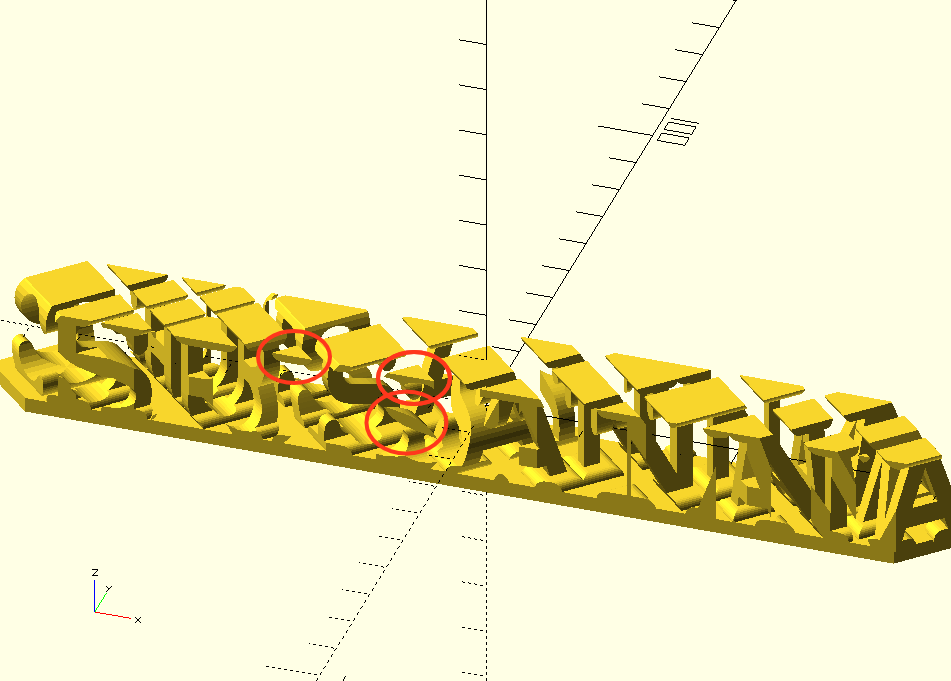

Save the design as STL

If using MakerWorld's Parametric Model Maker, click on the  button to have the last modifications to the parameters be reflected on your model, then click on the  button.

When this popup shows up

Click on the  button to download the STL version.

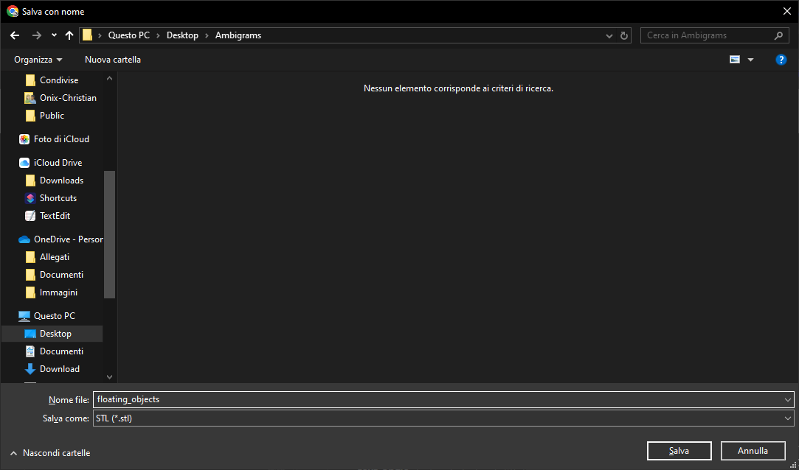

If your computer offers the possibility to save the file to a desired location, select a folder where you want to save it and choose a proper name, e. g. “floating_objects”, which fill create “floating_objects.stl”.

If your browser is configured to automatically save files, you will find the file named “Ambigram generator.stl” in the location you usually receive downloaded file, usually called the “Downloads” folder.

Now open a new Fusion 360 project, and from the top toolbar, in SOLID tab, choose INSERT => Insert Mesh

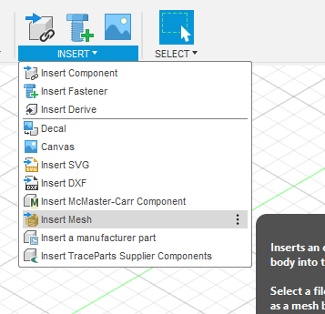

When this popup window will appear, click on **Select from my computer…** button.

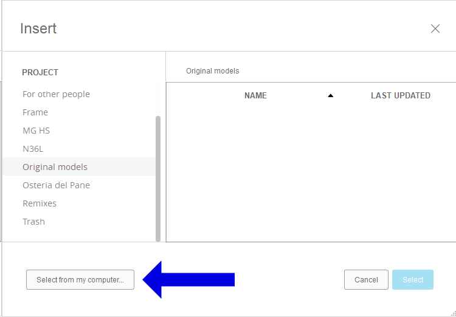

A file selection dialog will be shown, locate the freshly downloaded file and click on **Open**.

The object will be placed in the center of the scene, just click on **OK**.

Now we need to convert this to an object body.

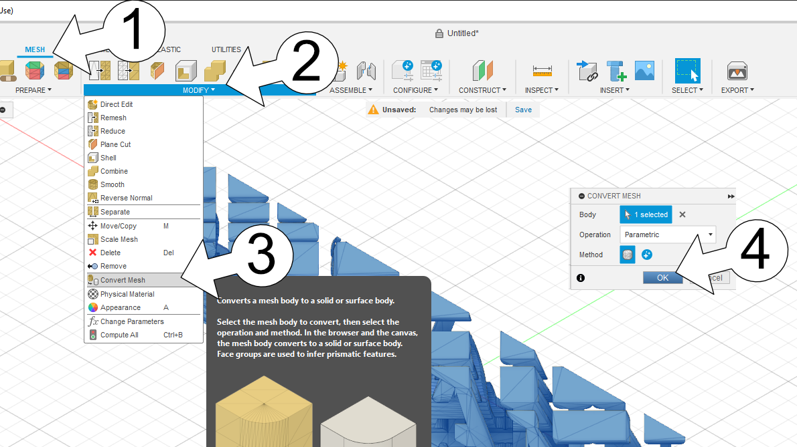

With the object selected, follow these steps:

1. Click on the **MESH** tab in the top toolbar;
2. Click on the **MODIFY** menu in the toolbar;
3. Select the **Convert Mesh** menu from the popup menu;
4. Click on **OK** to start the conversion.

Depending on the object complexity and your computer computational power, this could take some time.

Once finish, we need to disable the design history to be able to work on this freely.

Expand the **Bodies** group in the object browser by clicking on the left-pointing triangle on group name's left side.

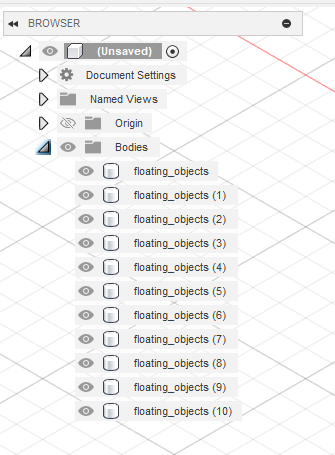

In the object browser, right click on the top nome e. g. *(Unsaved)*, and from the popup menu that appears choose **Do not capture Design History**.

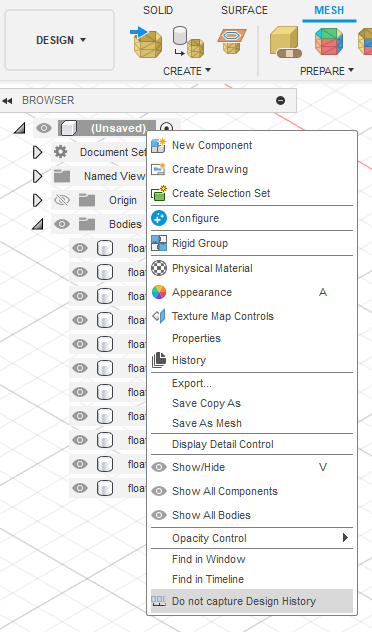

A confirmation dialog will appear, select **Continue** to stop capturing design history.

Now start selecting one by one the bodies, in the object browser's Bodies trunk.

The corresponding object will be blue highlighted on the screen, it this is a floating object, right click on his name in the object browser and select **Delete** from the popup menu that appeared.

**Important:** once you deleted all unwanted bodies (you should only have one object left), left click on the **Bodies** trunk in the object browser.

Now that we cleaned the object, we need to export the file back to STL.

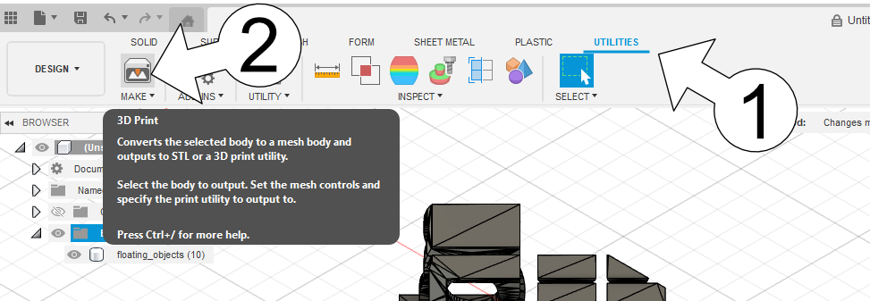

Follow these steps:

1. Select the **UTILITIES** tab in the top toolbar;
2. Select the **MAKE** icon.

When in Make mode, the object will be light-blue highlighted, please ensure to select the **STL format** (binary is preferred, but not mandatory), then click on **OK**.

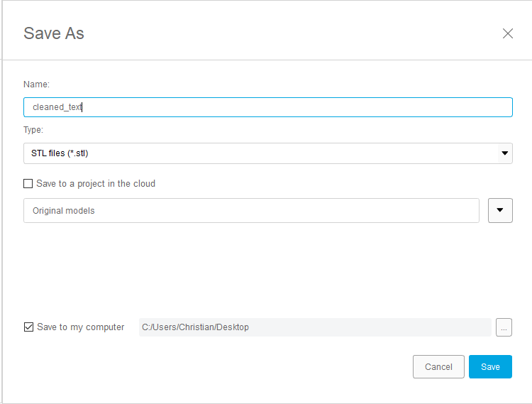

A dialog will popup, please be sure to check the **Save to my computer** option and select a valid folder, enter a name like cleaned_text, which will create cleaned_text.stl file, and finally click on **Save**.

Open [Bambu Studio](https://bambulab.com/en/download/studio) or your preferred slicer, start a new project and drag the file onto it.

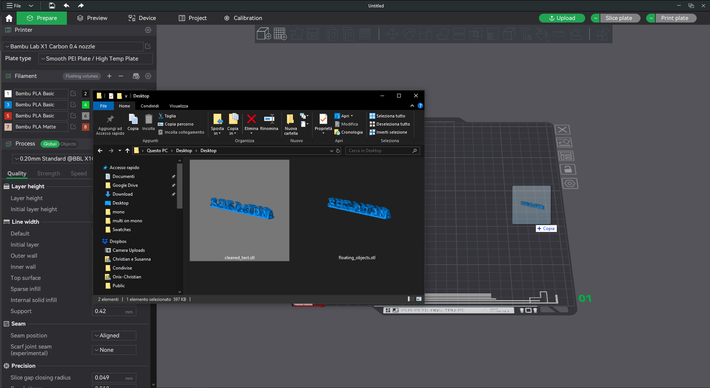

You will almost surely need to enable supports for printing this, so please be sure to be in the **Global** section, then go to the **Support** tab, activate **Enable support** and select *tree(auto)* as **Type** - I've got the most efficient and beautiful results using this.

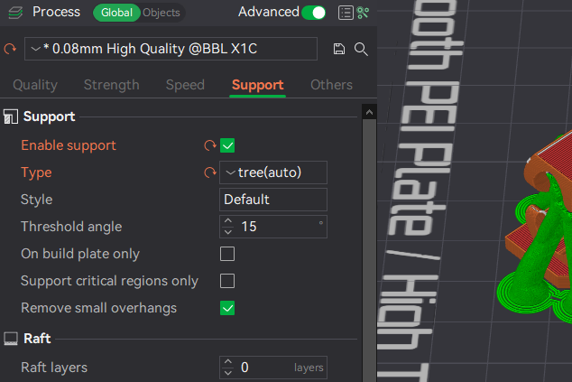

## How to use symbols in texts

If you want to use symbols in texts, you can with certain restrictions.

### On Windows

From the start menu, open **Characters Map**.

Select from the combobox the font you're using in your design, then scroll through characters to find the glyph you want to use, click on it, and press the **Select** button, then use the **Copy** button to copy it to the clipboard, go to the Parametric Model Maker, focus the input field and paste from the clipboard.

Alternatively you can use [**Character Map UWP**](https://apps.microsoft.com/detail/9wzdncrdxf41), select the font you're using from the left list, scroll through the glyphs to search the one you like most, then click it to focus it. Use the **Copy** button in the lower-right corner to copy it to the clipboard.

### On macOS

On the Apple system you have a similar tool which is **Font Book**, open it from the Applications folder.

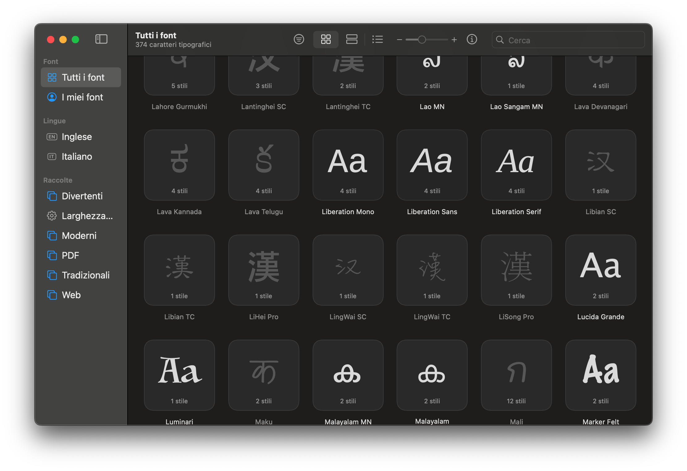

On startup you will be presented the full list of fonts installed on your system, search for the font you're using in the script and double click on it's icon to open up the font details.

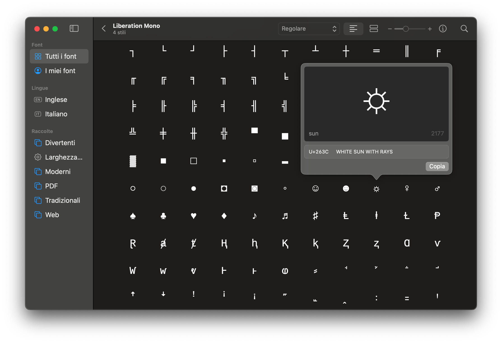

Scroll through the glyphs to search the one you like most, then click it to open it up and use the **Copy** button in the lower-right corner to copy it to the clipboard. Paste it into the script's input field.

## Version history

| Date       | Description                                                  |
| ---------- | ------------------------------------------------------------ |
| 2024-06-10 | - fix: uses baseline for text creation, this prevents letters like "J" (uppercase j) to break the design; - fix: cuts out all that goes below the baseline, preventing floating letters; - added selection of the shape mode between rectangle (legacy) and circle; - added selection of the shape heart (sperimental); - added top plate creation (request from a user). |
| 2024-06-08 | First public release.                                        |

## Thanks

Thanks to [@Stephanos](https://makerworld.com/en/@Stephanos) for the complete list of fonts and styles supported by MakerWorld he gave me access with his script **Parametric Model Maker ALL TEXT FONTS TEMPLATE** you can find [here](https://makerworld.com/en/models/484918).
